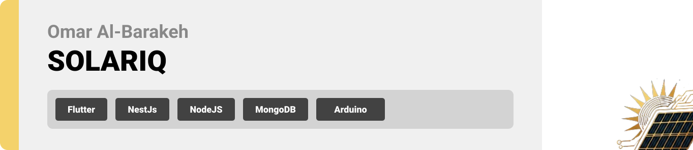

  

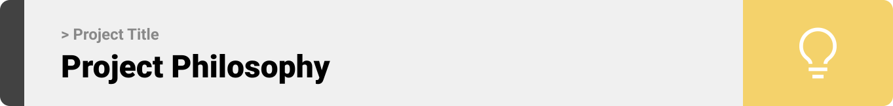

>Our AI-powered  " SOLARIQ " Solar App revolutionizes your solar experience.
 >It provides real-time insights into your solar panel performance, predicts energy production based on weather forecasts,
  >and offers personalized advice from our AI solar advisor. By connecting you with a community of solar enthusiasts,
   >we empower you to optimize your solar system and contribute to a sustainable future.

#### User Stories

#### Homeowner
- As a homeowner, I want to monitor my solar panel performance in real-time to optimize energy usage .
- As a homeowner, I want to receive weather-based energy predictions so that I can plan my energy consumption efficiently.
- As a homeowner, I want AI-driven advice on optimizing my solar setup to ensure I’m getting the most out of my system.

#### Business
- As a business, I want to track the energy production and storage of our solar system to minimize operational costs.
- As a business, I want real-time battery health tracking so that I can prevent downtimes caused by faulty storage systems.
- As a business, I want access to a solar marketplace to source high-quality solar equipment and services.

#### Solar Professional
- As a solar professional, I want to connect with other professionals and enthusiasts to exchange insights and grow my network.
- As a solar professional, I want access to a community forum where I can offer advice and learn from others.
- As a solar professional, I want to recommend optimal solar setups to clients using AI-driven insights.

#### Admin

- As an admin, I want to oversee users and their activities to maintain a secure and user-friendly platform.
- As an admin, I want to manage marketplace listings and ensure quality standards are met.
- As an admin, I want to monitor live chat support interactions to enhance the user experience.
  

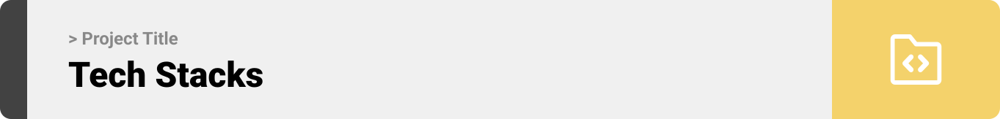

### SOLARIQ is built using the following technologies:

- Flutter: [Flutter app development framework](https://flutter.dev/).To develop a dynamic and responsive mobile application with seamless cross-platform performance.
- Node.js with NestJS: [NestJS - A progressive Node.js framework](https://nestjs.com/) For a robust and scalable backend architecture, ensuring efficient API management and business logic.
- OpenWeather API: For providing weather-based energy forecasts to optimize solar energy usage.
- OpenAI API: To power the AI solar advisor, delivering personalized energy insights and recommendations.

  

We designed SOLARIQ using wireframes and mockups, iterating on the design until we reached the ideal layout for easy navigation and a seamless user experience.

- Project Figma design [figma](https://www.figma.com/design/5H9Fa6QPBZsvvb9nZchmTV/Untitled?t=n2Z8NsetSEEd6VQz-1)

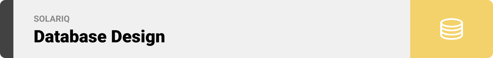
This JSON format presents a modular representation of MongoDB schemas, showcasing User, Cart, SolarInfo, and Item models with enhanced clarity, descriptions, and references for relationships
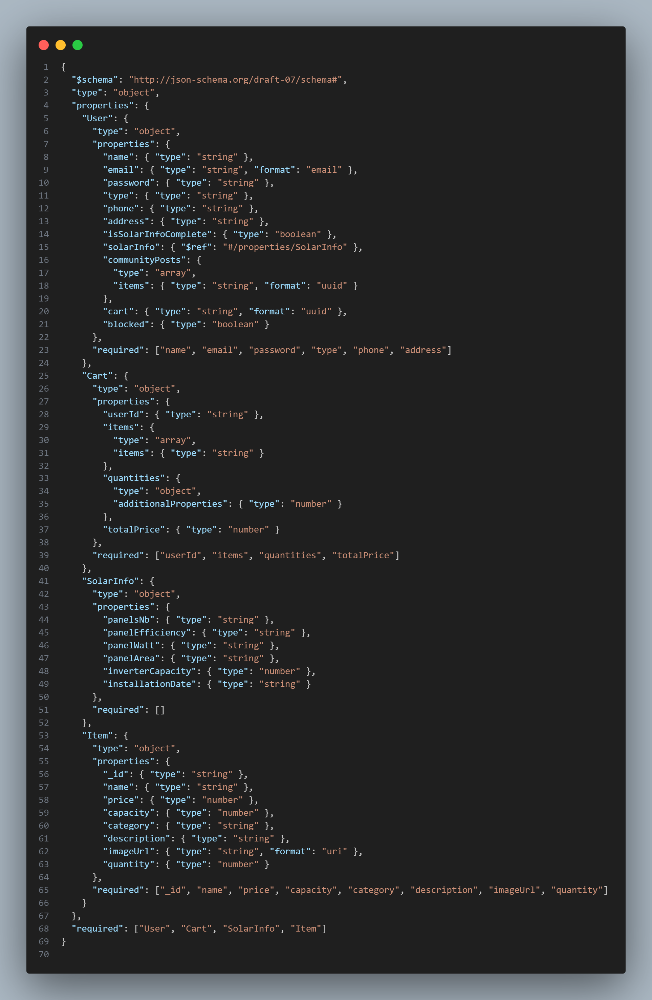

### User Screens (Mobile)
| Login screen  | Register screen | Solarinfo Form |
| ---| ---| ---|
| 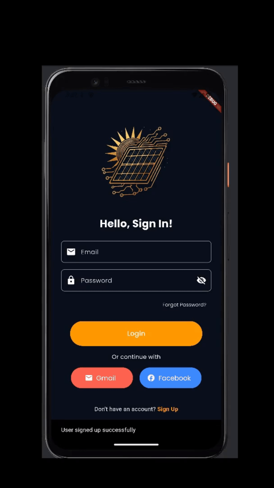 | 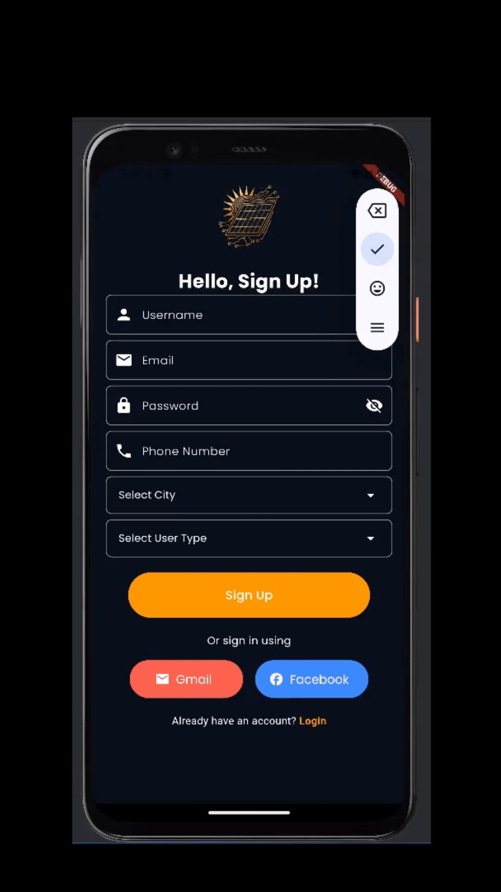 | 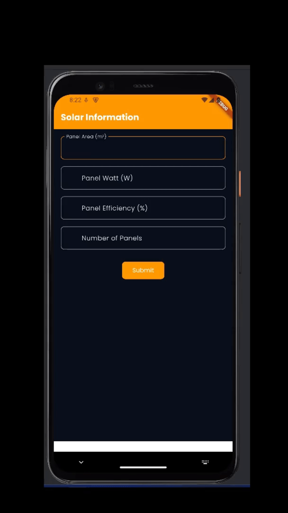
| Battery Life Tracking | Real Time Monitoring | Weather Power Prediction |
|  |  | 
| Community | Market | ChatBot |
| 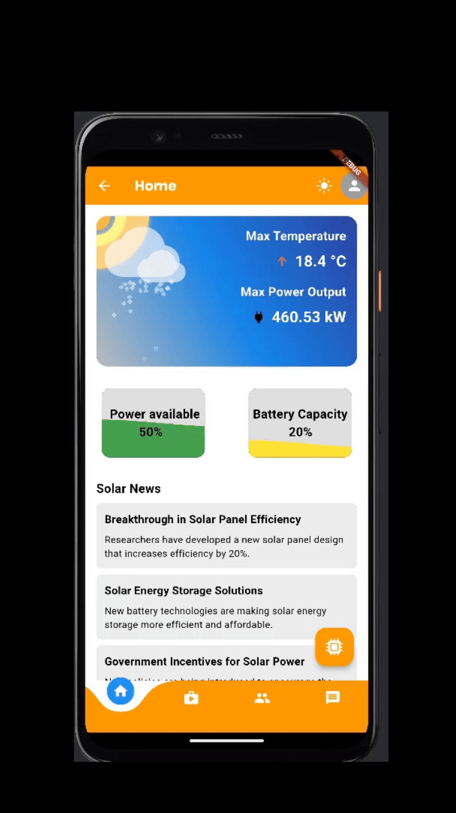 | 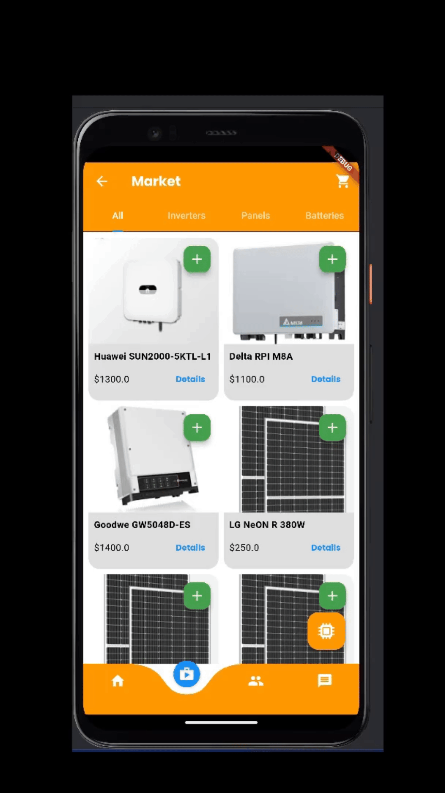 | 
| ChatBot Form |
|  

### Admin Screens (Web)
| Login screen  | Register screen |  
| ---| ---|
| 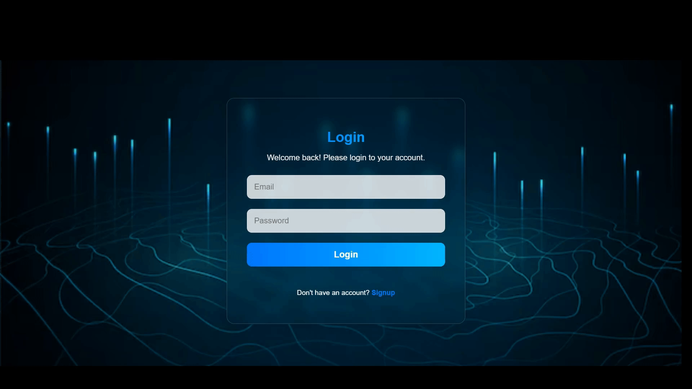 | 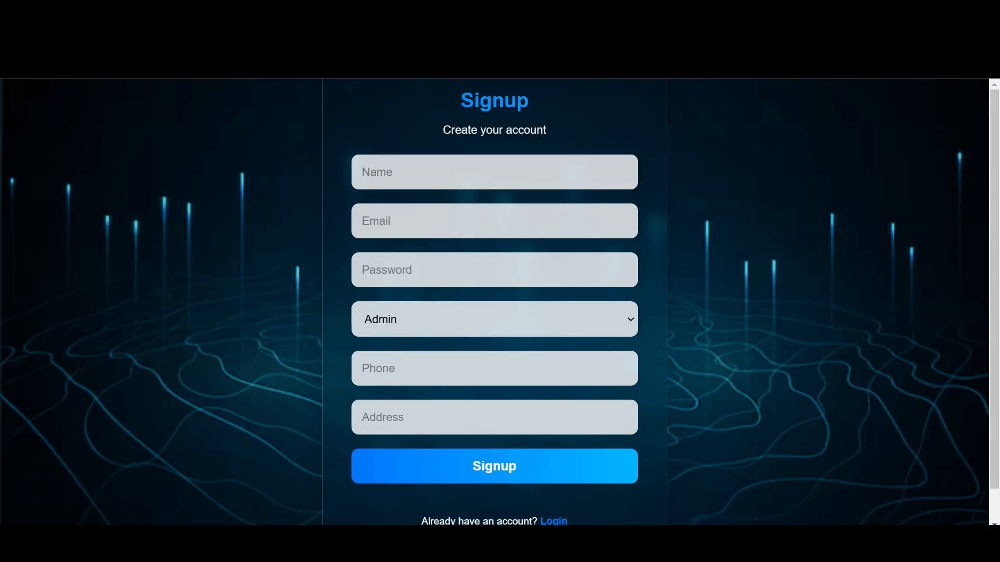 |
| User-panel  |  Create-item |
| ---| ---|
|  | 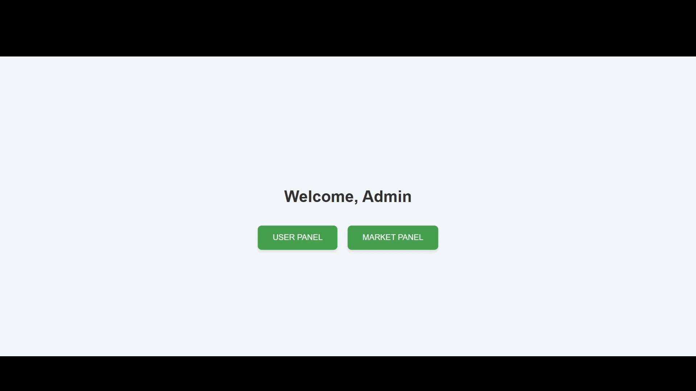 |
| Update-item | Delete-item |
| ---| ---|
| 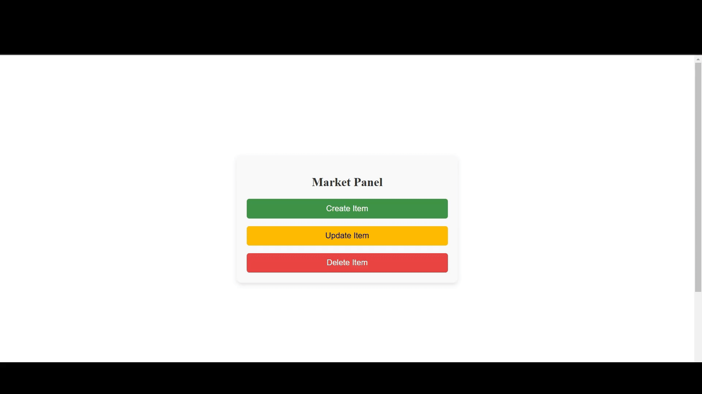 |  |

  

