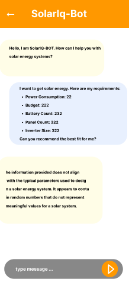
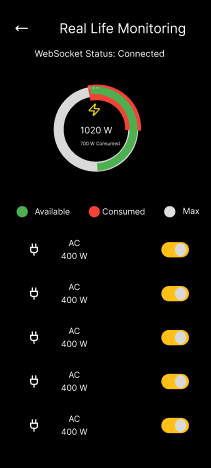
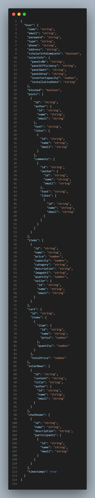
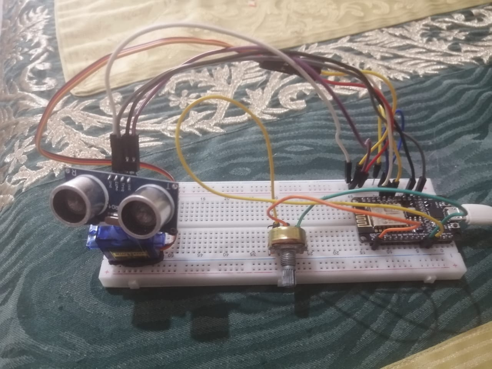
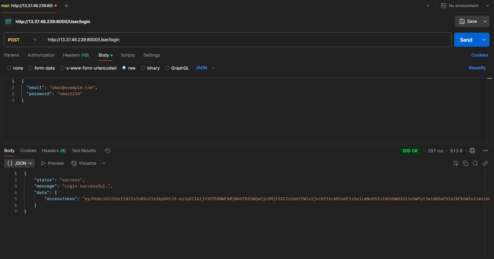
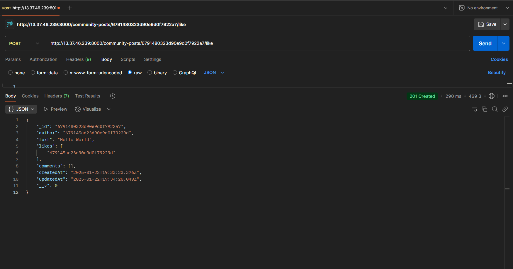
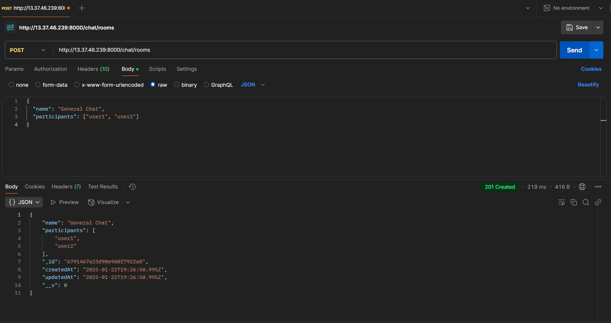
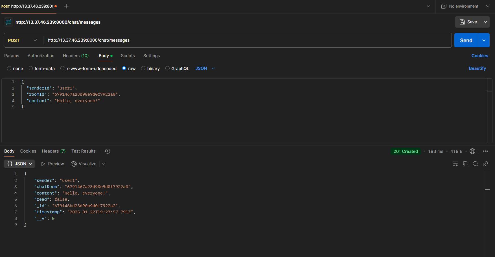
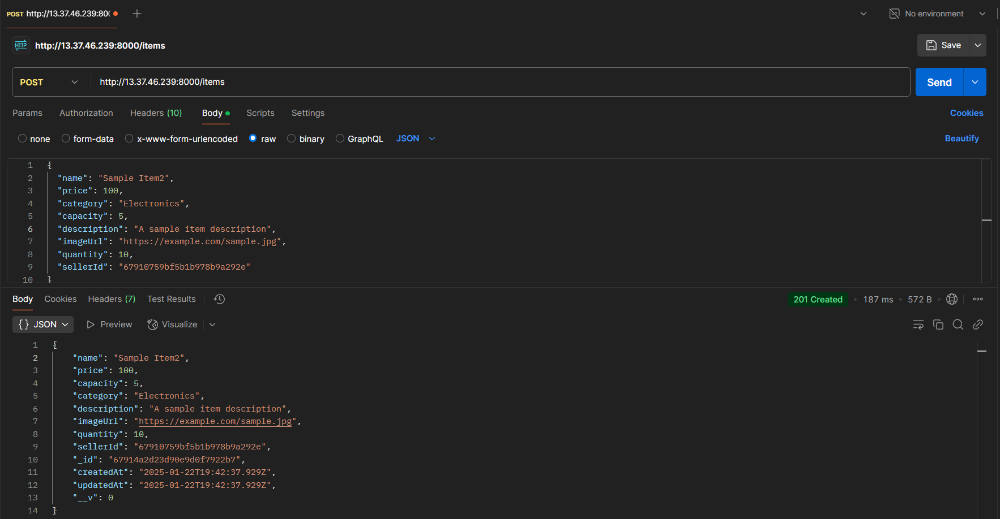
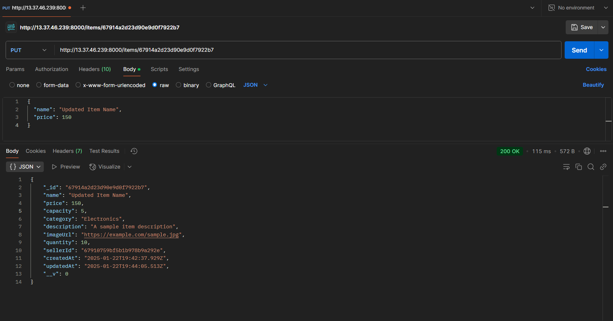

<br><br>


>Our AI-powered  " SOLARIQ " Solar App revolutionizes your solar experience.
 >It provides real-time insights into your solar panel performance, predicts energy production based on weather forecasts,
  >and offers personalized advice from our AI solar advisor. By connecting you with a community of solar enthusiasts,
   >we empower you to optimize your solar system and contribute to a sustainable future.

#### User Stories

#### Homeowner
- As a homeowner, I want to monitor my solar panel performance in real-time to optimize energy usage .
- As a homeowner, I want to receive weather-based energy predictions so that I can plan my energy consumption efficiently.
- As a homeowner, I want AI-driven advice on optimizing my solar setup to ensure I’m getting the most out of my system.

#### Business
- As a business, I want to track the energy production and storage of our solar system to minimize operational costs.
- As a business, I want real-time battery health tracking so that I can prevent downtimes caused by faulty storage systems.
- As a business, I want access to a solar marketplace to source high-quality solar equipment and services.

#### Solar Professional
- As a solar professional, I want to connect with other professionals and enthusiasts to exchange insights and grow my network.
- As a solar professional, I want access to a community forum where I can offer advice and learn from others.
- As a solar professional, I want to recommend optimal solar setups to clients using AI-driven insights.

#### Admin

- As an admin, I want to oversee users and their activities to maintain a secure and user-friendly platform.
- As an admin, I want to manage marketplace listings and ensure quality standards are met.
- As an admin, I want to monitor live chat support interactions to enhance the user experience.
<br><br>


### SOLARIQ is built using the following technologies:

- Flutter: [Flutter app development framework](https://flutter.dev/).A powerful app development framework used to build a dynamic, responsive, and visually appealing mobile application with seamless cross-platform performance.
- Node.js with NestJS: [NestJS - A progressive Node.js framework](https://nestjs.com/) A progressive Node.js framework employed to develop a robust and scalable backend architecture, ensuring efficient API management, secure data handling, and well-structured business logic.
- React: [React Library](https://react.dev/)A flexible and efficient JavaScript library utilized to create a modern, interactive, and user-friendly web interface for enhanced user engagement.
- MongoDB: [Mongo Database](https://www.mongodb.com/docs/) A NoSQL database chosen for its scalability and flexibility, enabling efficient storage and management of solar energy data, user preferences, and real-time updates.
- OpenWeather API:[Weather provider](https://openweathermap.org/api) For providing weather-based energy forecasts to optimize solar energy usage.
- Gemini AI:[Gemini AI](https://ai.google/discover/)  The core engine powering the AI solar advisor, delivering personalized energy insights, recommendations, and actionable strategies for maximizing solar efficiency.
- Arduino:[Arduino](https://docs.arduino.cc/)  is an open-source electronics platform based on easy-to-use hardware and software. It consists of a microcontroller that can be programmed to read inputs (e.g., sensor data) and control outputs (e.g., actuators, LEDs, motors). In the context of a solar energy system, Arduino can be used to collect real-time data from sensors (e.g., solar panel voltage, current, temperature) and control devices (e.g., relays, inverters).
- ESP8266:[ESP8266](https://arduino-esp8266.readthedocs.io/en/latest/) is a low-cost Wi-Fi module with a full TCP/IP stack and microcontroller capability. It enables Arduino (or other microcontrollers) to connect to the internet, making it a key component for IoT applications. In this system, the ESP8266 acts as the bridge between the Arduino hardware and the web-based backend or frontend, allowing data to be transmitted over Wi-Fi for real-time monitoring and control.
- WebSockets:[WebSockets](https://developer.mozilla.org/en-US/docs/Web/API/WebSockets_API)is a communication protocol that provides full-duplex, real-time communication between a client (e.g., a web or mobile app) and a server. Unlike traditional HTTP requests, WebSockets maintain a persistent connection, enabling instant data exchange without the need for repeated polling. In this setup, WebSockets facilitate seamless communication between the Arduino-ESP8266 hardware and the backend/frontend systems, ensuring real-time updates (e.g., sensor data, weather conditions) and control commands (e.g., adjusting solar panel angles, turning devices on/off)

<br><br>


We designed SOLARIQ using wireframes and mockups, iterating on the design until we reached the ideal layout for easy navigation and a seamless user experience.

- Project Figma design [figma](https://www.figma.com/design/5H9Fa6QPBZsvvb9nZchmTV/Untitled?t=n2Z8NsetSEEd6VQz-1)
  <br>
- ### Mockups

| Market screen                                | ChatBot Screen                                   | RealTime Screen                                  |
| ------------------------------------------ | -------------------------------------------------------- |-------------------------------------------------------- |
|  |  | |
<br><br>


This JSON format presents a modular representation of MongoDB schemas, showcasing User, Cart, SolarInfo, Item, and Weather models. Each schema is designed with enhanced clarity, descriptions, and references to establish relationships between collections. This structure ensures efficient data management and scalability for a solar energy management system. <br>


| Backend Schema                              | Weather Schema                                   | 
| ------------------------------------------ | -------------------------------------------------------- |
|  |  |


### User Screens (Mobile)
| Login screen  | Register screen | Solarinfo Form |
| ---| ---| ---|
|  |  | 
| Battery Life Tracking | Real Time Monitoring | Weather Power Prediction |
|  |  | 
| Community | Market | ChatBot |
|  |  | 
| ChatBot Form |
|  

### Admin Screens (Web)
| Login screen  | Register screen |  
| ---| ---|
|  |  |
| User-panel  |  Create-item |
| ---| ---|
|  |  |
| Update-item | Delete-item |
| ---| ---|
|  |  |

### IoT project
In my IoT project, I integrated an ESP8266 microcontroller to serve as the communication bridge between various components, leveraging the concept of WebSocket for real-time, bidirectional data exchange. A potentiometer was utilized to simulate the behavior of a solar panel, capturing wattage. I could control the flow of watts by adjusting the potentiometer, and this data was transmitted to my **SolarIQ** Flutter application instantly. Additionally, the project included a bidirectional communication setup, enabling my Flutter app to send control signals to a servo motor. The servo motor, equipped with an ultrasonic sensor, functioned as a radar system to detect and measure distances dynamically. By utilizing WebSocket technology, this project ensured seamless, low-latency communication between hardware and software, enabling efficient real-time monitoring and control to emulate a smart solar energy system.
<br>

<br><br>

<!-- AWS Deployment -->


### Deployment Description:

- This project leverages AWS deployment strategies to seamlessly integrate and deploy the Solar-IQ backend.

| Login API                        | Post like API           |
| ----------------------------------- | ------------------------------- |
|  |  |
| Create ChatRoom API                     | Send Message API                          |
|   |    |
| Create Item API                     | Update Item API                          |
|   |    |

<br><br>


> To set up Solar-IQ locally, follow these steps:

### Prerequisites

1-Node.js & npm
Ensure you have Node.js and npm installed on your system.
Install npm globally if not already installed:
* npm
  ```sh
  npm install npm@latest -g
  ```
2-Flutter SDK
Install the Flutter SDK and set it up by following the official guide:[Flutter Installation](https://flutter.dev/)

3-MongoDB
Install and run MongoDB locally or use a cloud database.

4-Arduino IDE
Download and install the Arduino IDE: Arduino IDE Download.[Arduino IDE Download.](https://www.arduino.cc/en/software)

### Installation

1. Get a free API Key at [open weather](https://openweathermap.org/api)
2. Clone the repo
   git clone [github](https://github.com/omar-albarakeh/SolarIQ.git)
3. Set Up the React (Web)
   ```sh
   npm install
   ```
4. Set Up the Flutter (Mobile)
   ```sh
   flutter pub get
   ```
5.Configure the ESP8266
Open the Arduino IDE and upload the code to the ESP8266.
Update the Wi-Fi SSID and password in the code.
Replace the server IP with your laptop's IP address.

6.Update Flutter Configuration

Update the API endpoints in your Flutter app to match:
Your laptop's IP address for the backend services.
The ESP8266's IP address for real-time communication.
Ensure both the ESP8266 and your laptop are connected to the same Wi-Fi network.
